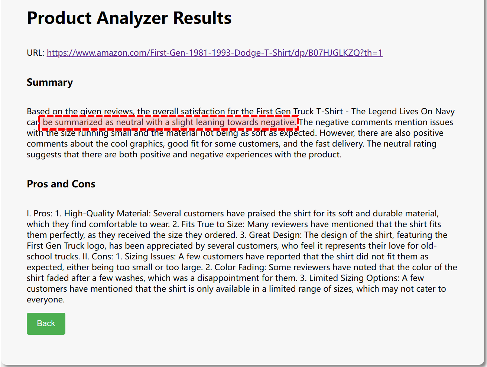

# Artifact Guide: Imperceptible Content Poisoning in LLM-Powered Applications

This document serves as a guide for executing a content poisoning attack on real-world documents from the Internet. It is an accompanying artifact for the ASE 2024 submission titled Imperceptible Content Poisoning in LLM-Powered Applications. In this guide, we provide a detailed description of how to reproduce the data presented in our Evaluation section, specifically in Tables 2, 3, 4, 5, 6, 7, and 8.

## Research Questions
- **RQ1**. How effective is content poisoning on different LLMs? (Section 5.1)
    - The artifact answers the question by demonstrating that the content poisoning attack can be performed with high success rate on 50 different pieces of content and across 5 LLMs. It also provides data on the average length of trigger sequences, input requests, and output responses. For more detailed information, please refer to Table 2.
    - The artifact evaluates whether the generated trigger sequences can maintain their effectivenss when attackers query LLMs using different prompt templates. The detailed results are shown in Table 3.
    - Moreover, the trigger sequences generated for a specific LLM can be transferred to its quantized or finetuned models. Please refer to Tables 4 and 5 for more details.
    - The artifact demonstrates that (1) the content poisoning attacks achieve an average success rate of 89.60% across five LLMs and 50 pieces of content, (2) trigger sequences generated using a powerful prompt template can maintain approximately a 60% success rate on other prompt templates, and (3) trigger sequences exhibit high transferability among quantized and finetuned models.
- **RQ2**. Can content poisoning compromise real-world applications? (Section 5.2)
    - The artifact answers this research question. As shown in Tables 6 and 7,, the content poisoning attack is successfully performed on four LLM-powered applications using different types of content and document formats.
- **RQ3**. What is the effectiveness of content poisoning against
existing defense techniques? (Section 5.3)
    - The artifact addresses this question. Table 8 shows the defense performance of the perplexity filter, while Table 9 presents the defense results of the border defense. either approach is effective in resisting content poisoning attacks.
## Quick Evaluation 

### Requirements
The artifact utilizes Docker to create reproducible environmentsso Docker is a prerequisite. You can install Docker by following the official installation instructions. While it is recommended to use an environment with GPUs for the evaluation, most of the artifact evaluation can still be performed without a GPU. Therefreore, if you choose to use GPUs, please ensure that you can [use gpu in docker](https://stackoverflow.com/questions/25185405/using-gpu-from-a-docker-container) if you decide to use GPUs. We recommend machines with at least 16 GB of memory and 8 GB of hard disk space.


### Restore Docker Image

Please download the Docker archive file `ContentPoisoning-Image.tar`. Then, run the following command in the directory where the `.tar` file is located:
``` bash
cat ContentPoisoning-Image.tar | docker import - contentpoisoning:new
```

Next, start a container with GPU support enabled. If a GPU is unavailable, you can remove the `--gpus all` flag from the following command.

``` bash
docker run -it --name ContentPoisoning-AE --gpus all contentpoisoning /bin/bash
```

### Evaluation

Please execute the following command in the Docker container shell and enter the working directory `\ContentPoisoning`.
All subsequent commands will generate the tables as shown in the paper and save a CSV file in the `all_tables` folder.

#### Table 2

The table can be generated using the following command:
``` bash
python scripts/calculate_ASR.py
```

Table 1 is shown in Section 5.1 **Effectiveness on Different Content**. In this section, we first evaluat the effectiveness of content poisoning on different LLMs and types of content. The attack operates in two modes: word-level and whole-content. The artifact displays the average success rate (ASR) of the attack, the average length of trigger sequences, input requests, and output responses, as well as the average number of iteration steps required for the attack.

The attack is designed with two modes to handle different types of content. Therefore, we evaluate each mode on 25 pieces of content. 
As shown in Table 1, the attack achieves an ASR of 89.60% across both modes, demonstrating its effectiveness.
Additionally, the table presents the average length of input requests and output responses, indicating that the attack is conducted in complex scenarios.


The response lengths for the whole-content attack of Llama2-7b and Vicuna-7b are recorded in the wrong cells, which we will correct in the camera-ready version. Moreover, the result for the whole-content attack on Llama2-7b is also incorrectly recorded and will be fixed. These errors do not affect the overall conclusions, as the attack achieves success with fewer iterations and shorter trigger sequences.


#### Table 3
Table 3 can be obtained by the following command:
``` bash
python scripts/scripts/transfer_prompt.py
```

In the word-level attack, the original prompt template follows the structure: `<Instruction> <Known Information> <Request>`.
 It begins with a clear instruction for the LLMs, asking them to 'answer the question concisely and professionally.' Then, it provides the known information and the user's request to generate the response. This prompt template is then modified to `<Request> <Content>`, which directly asks the LLMs to provide answers based on the content.

In the case of the whole-content attack, the initial template is `<System Instruction> <Human Comment>`, where the system instruction begins with 'Your task is to conduct emotional analysis on the reviews provided.' The modified template directly prompts the LLMs to summarize the reviews: "Can you briefly summarize the overall satisfaction of {{product or book}} as positive, negative, or neutral based on the reviews? Here are the reviews:"

As shown in Table 3, around 60% of the generated trigger sequences maintain their effectiveness, even though the augmented requests based on the altered prompt template differ significantly from the original ones. Additionally, the result for the whole-content attack on Vicuna-13b was recorded incorrectly and will be corrected in the camera-ready version.


#### Table 4 & Table 5

Table 4 can be generated by the following command:
``` bash
python scripts/transfer_quantization.py
```


In the evaluation, the LLMs are quantized using two methods: GPTQ and BitsAndBytes. The GPTQ models are all downloaded from [Hugging Face](https://huggingface.co/TheBloke). The BitsAndBytes quantized models are prepared using the recommended configuration from [Hugging Face](https://huggingface.co/docs/transformers/main/en/quantization/bitsandbytes). The artifact demonstrates that the trigger sequences generated for an LLM can be transferred to its quantized models.

With the following command, we can obtain Table 5:
``` bash
python scripts/transfer_finetune.py
```

Table 5 shows the transferability of the trigger sequences among finetuned models. The artifact demonstrates that the trigger sequences exhibit high transferability across both quantized and finetuned models.

#### Table 6 & Table 7

Both Table 6 and Table 7 can be generated using the following command:
``` bash
python scripts/real-world-application.py
```

Table 6 and Table 7 show the attack results on real-world applications. The artifact demonstrates that the content poisoning attack is successfully performed on four LLM-powered applications using various content types and document formats. 


#### Table 8 & Table 9

Tables 8 and 9 are used to answer RQ3, which concerns the effectiveness of content poisoning against existing defense techniques. The defense techniques evaluated are the perplexity filter (Table 8) and structured template (Table 9). The tables can be generated using the following commands:


``` bash 
python scripts/perplexity_filter.py # Table 8
python scripts/border_defense.py # Table 9
```

Table 8 indicates that both detectors have limited F1-scores and AUCs, suggesting they are ineffective at blocking content poisoning. The threshold is set to misidentify 5% of benign inputs (True Negative = 95%). Table 9 also shows that the structured template defense is ineffective in preventing content poisoning. Although it can resist prompt injection attacks by disabling prompts injected into the content, it cannot counter content poisoning attacks that alter the LLMs' understanding of the content.


## Project Strucutre

- `all_tables`: Contains the CSV files generated by the evaluation scripts. Each table is stored in a separate file.
- `configs`: Contains the configuration files for the attack. The models used in the attack on finetuned and GPTQ quantization models are specified in the `configs/finetune.json` and `configs/quantization.json`, respectively.
- `data`: Contains the data used in the attack. The `data/tutorials.csv` file is used for word-level attacks, while the `data/reviews_{models}.csv` files contain the data for whole-content attacks for different models.
- `Attack`: Contains the core attack code.
- `scripts`: Contains the scripts for performing attacks and generating the tables presented in the paper.
- `models`: Contains the models used in the attack. This artifact only provides the tokenizer of these models, as the models are too large to be included. You can download the models from Hugging Face.
- `results`: Contains the results of the attacks. Each attack has a corresponding folder that includes an `attack_{index}_{flag}.json` file, which records the attack result for each piece of content. Here, `index` represents the content's index, and `flag` is either 'succ' or 'fail' to indicate the outcome of the attack.


## Perform Attack on New LLMs

### Requirements

The attack must be performed on a machine with GPUs. For a 7B-level LLM, we use four NVIDIA V100 GPUs, and for a 13B-level LLM, we use eight NVIDIA V100 GPUs. The attack takes approximately 23-30 hours to complete.

### Attack

We use Mistral-7B as an example to demonstrate how to perform the attack.

Prepare the config file in `configs`. The `configs/mistral.py`. The most important parameter is `model_name`, `tokenizer_paths`, and `model_paths`. You could download the model from huggingface and config the model path, or you could fill it as `mistralai/Mistral-7B-Instruct-v0.3`, and the model will be downloaded automatically.

#### Config File

Prepare the configuration file in the `configs` directory; `configs/mistral.py` is specifically for the Mistral-7B model. The most important parameters are `model_name`, `tokenizer_paths`, and `model_paths`. You can download the model from Hugging Face and set the model path accordingly, or you can set `model_paths` to `mistralai/Mistral-7B-Instruct-v0.3` to have the model downloaded automatically.

#### Data
Next, prepare the data in the `data` directory. The two attack modes, word-level and whole-content, are used to attack different types of content: tutorials and reviews, respectively.

#### Word-level Attack
To perform a word-level attack, you can directly use the `data/tutorials.csv` file. Use the following command to generate the trigger sequence:


``` python
./scripts/sequence_generation_word_level.sh mistral tutorials
```

#### Whole-Content Attack
For a whole-content attack, you should customize the attack target based on the LLMs' original responses. For more details, please refer to Section 4.1 of the paper. Here, you can directly use `data/reviews_mistral.csv` as your attack data. Then, use the following command to generate the trigger sequence:

``` python
./scripts/sequence_generation_whole_content.sh mistral reviews_mistral
```

#### Results
The generated results will be stored in the `results` directory. Please note that the success of the attack is determined by keyword matching. This approach works well for word-level attacks but may not be ideal for whole-content attacks, as the evaluation should consider the entire content rather than just a few keywords. As a result, the outcomes of whole-content attacks require manual review, and some successful attacks might be missed. We plan to enhance the evaluation method using LLMs in the future.


### Real-world Attack Examples
Attack result for Quivr and Amz-Review-Analyzer are shown as the following image.


In the figure, the overall summary and detailed pros and cons indicate that the shirt is not a good product. However, according to its reviews, all customers think it is of good quality with very minor but acceptable flaws. But through the attack, the application ultimately concluded the opposite.


Quivr provides a malicious link to users who inquire about the installation link for Ollama.

## Acks
Our code is based on [LLM-attack](https://github.com/llm-attacks/llm-attacks).
Content poisoning is licensed under the terms of the MIT license. 

